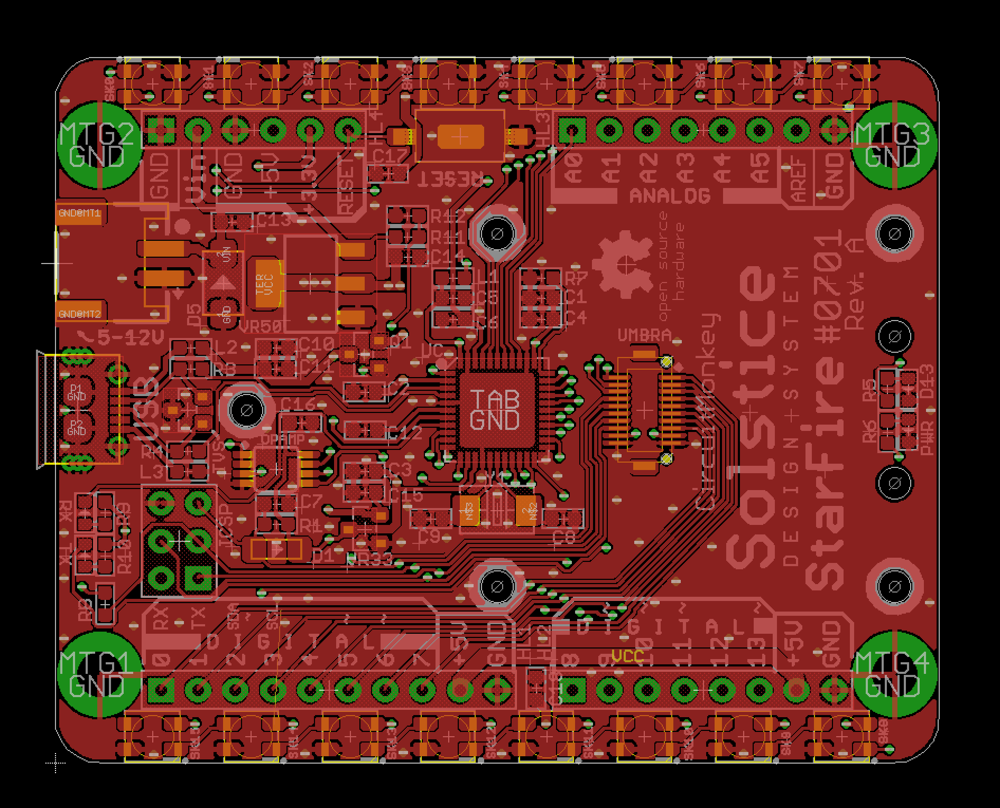

# solstice-core-starfire-pcb
Solstice Design System —  *Starfire* Core —  Eagle PCB

PCB files for the **Circuit Monkey** *StarFire*  **Solstice Core** *Module*

Format is EagleCAD 9.x schematic and board layout

*StarFire* is one of the first *Solstice Core* modules.

For more details, check out the product page at

  * https://www.circuitmonkey.com/product/0701   ( [404 - not found] this link is not yet active)

### Revision Notes
* Rev. 0 - Initial board design.  This revision was made for evaluation and only
one unit ever made.

* Rev. A - First revision meant for human consumption.
  * Swapped Vin and GND pins on HaLo connector.   Vin was dangerously close to GND mounting hole.
  * Changed WS2812B (5x5mm) LEDs to smaller SK6812(3.5x3.5mm LEDs)
  * SK6812 LED chain is driven by SCK pin.  Was MISO pin on Rev.0 and pattern would scramble when ISP programming the board.
  * Reset switch changed to slightly larger type.
  * Mounting holes on corners changed from 2mm pan head-style to 3mm socket head type.  2mm hardware is harder to source.
  * Added Umbra connector.  A Umbra is 20-pin micro-shield that is approx. 1x1 inch and can mount under the regular sheild(HaLo).
  * Added Umbra hardware mounting points throughout PCB.
  * Added mounting holes to support light pipe option at the PWR and D13 LEDs.

#### Rev A. Issues:
 * USB connector footprint does not match physical connector sourced using Seeed library information.

## Designed by Circuit Monkey
Creative Commons Attribution, Share-Alike license, check license.txt for more information. Derivative of "Arduino Leonardo Reference design" (http://www.arduino.cc/en/Main/ArduinoBoardLeonardo)

All text above must be included in any redistribution
